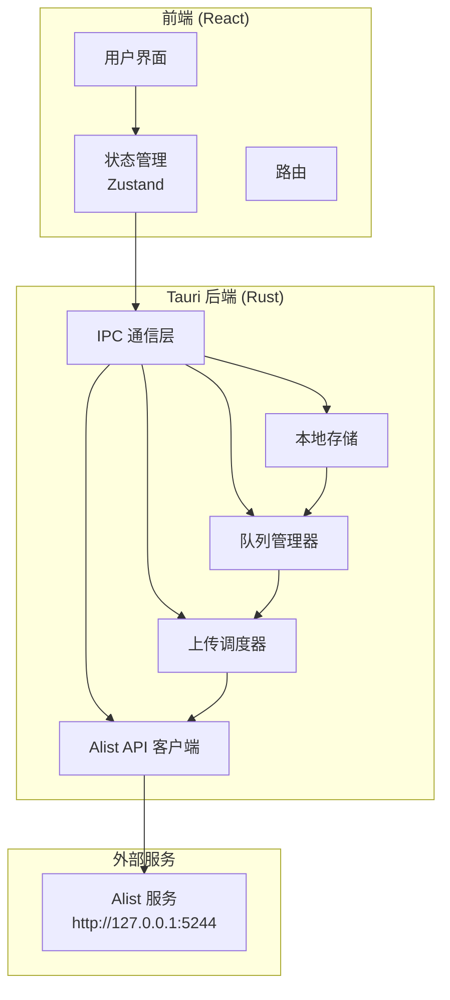

# Alist 上传管理器 - 技术设计

Feature Name: alist-uploader
Updated: 2026-01-03

## 简介

基于 Tauri + React 的 Alist 上传管理客户端，支持文件拖拽、队列管理、持久化存储和可配置的上传策略。

## 架构



### 技术栈选择

| 层级 | 技术 | 说明 |
|------|------|------|
| **桌面框架** | Tauri 2.x | Rust 后端 + Web 前端，体积小，性能优 |
| **前端框架** | React 18.x | 组件化 UI，生态丰富 |
| **状态管理** | Zustand | 轻量级状态管理，配合 Tauri 更简洁 |
| **UI 组件库** | Shadcn/ui | 基于 Tailwind，可定制性强 |
| **构建工具** | Vite | 快速开发和构建 |
| **后端语言** | Rust | 安全、高性能，适合文件操作和并发 |
| **HTTP 客户端** | reqwest | Rust 异步 HTTP 库 |
| **序列化** | serde + serde_json | Rust JSON 处理 |
| **数据库** | JSON 文件 | 简单场景，直接存储无需 ORM |

## 组件与接口

### 前端组件结构

```
src/
├── components/
│   ├── UploadZone.tsx          # 拖拽上传区域
│   ├── QueueList.tsx           # 待上传队列列表
│   ├── HistoryList.tsx         # 历史记录列表
│   ├── TaskItem.tsx            # 单个任务项
│   ├── ConfigPanel.tsx         # 配置面板
│   ├── ProgressBar.tsx         # 进度条（可选）
│   └── FileExistsDialog.tsx    # 文件存在询问对话框
├── pages/
│   ├── Index.tsx               # 主页面
│   └── Settings.tsx            # 设置页面
├── stores/
│   ├── queueStore.ts           # 队列状态
│   ├── configStore.ts          # 配置状态
│   └── historyStore.ts         # 历史状态
├── hooks/
│   └── useTauri.ts             # Tauri IPC 封装
└── types/
    └── index.ts                # TypeScript 类型定义
```

### Tauri 后端模块

```
src-tauri/
├── src/
│   ├── main.rs                 # 程序入口
│   ├── commands/
│   │   ├── queue.rs            # 队列操作命令
│   │   ├── upload.rs           # 上传相关命令
│   │   ├── config.rs           # 配置相关命令
│   │   └── history.rs          # 历史相关命令
│   ├── services/
│   │   ├── queue_manager.rs    # 队列管理逻辑
│   │   ├── upload_scheduler.rs # 上传调度器
│   │   └── alist_client.rs     # Alist API 封装
│   ├── models/
│   │   ├── mod.rs              # 数据模型定义
│   │   ├── task.rs             # 任务结构
│   │   └── config.rs           # 配置结构
│   └── utils/
│       ├── fs.rs               # 文件操作工具
│       └── storage.rs          # 持久化工具
└── data/                       # 数据存储目录
    ├── queue.json
    ├── history.json
    └── config.json
```

### IPC 命令接口

```rust
// 队列管理
#[tauri::command]
async fn get_queue() -> Vec<UploadTask>
#[tauri::command]
async fn add_to_queue(file_path: String, alist_path: String) -> Result<(), String>
#[tauri::command]
async fn remove_from_queue(task_id: String) -> Result<(), String>
#[tauri::command]
async fn clear_queue() -> Result<(), String>

// 上传控制
#[tauri::command]
async fn start_upload() -> Result<(), String>
#[tauri::command]
async fn pause_upload() -> Result<(), String>
#[tauri::command]
async fn cancel_upload(task_id: String) -> Result<(), String>
#[tauri::command]
async fn retry_upload(task_id: String) -> Result<(), String>

// 历史记录
#[tauri::command]
async fn get_history() -> Vec<UploadTask>
#[tauri::command]
async fn clear_history() -> Result<(), String>

// 配置管理
#[tauri::command]
async fn get_config() -> AppConfig
#[tauri::command]
async fn save_config(config: AppConfig) -> Result<(), String>
#[tauri::command]
async fn test_alist_connection() -> Result<(), String>

// 文件操作
#[tauri::command]
async fn get_file_info(path: String) -> Result<FileInfo, String>
#[tauri::command]
async fn check_file_exists(alist_path: String, filename: String) -> Result<bool, String>
```

## 数据模型

### 上传任务 (UploadTask)

```typescript
interface UploadTask {
  id: string;                    // UUID 唯一标识
  file: {
    path: string;                // 本地文件绝对路径
    name: string;                // 文件名
    size: number;                // 文件大小（字节）
  };
  alistPath: string;             // Alist 目标路径
  status: 'pending' | 'uploading' | 'completed' | 'failed' | 'cancelled';
  progress: number;              // 进度 0-100
  retryCount: number;            // 已重试次数
  error?: string;                // 错误信息
  startTime?: string;            // 开始时间 ISO8601
  endTime?: string;              // 完成时间 ISO8601
  duration?: number;             // 耗时（秒）
  createdAt: string;             // 创建时间 ISO8601
  updatedAt: string;             // 更新时间 ISO8601
}
```

### 应用配置 (AppConfig)

```typescript
interface AppConfig {
  alist: {
    baseUrl: string;             // Alist 服务地址
    token: string;               // Alist Token
  };
  upload: {
    concurrency: number;         // 并发数，默认 1
    maxRetries: number;          // 最大重试次数，默认 5
    asTask: boolean;             // 是否使用 As-Task，默认 true
    fileExistsStrategy: 'ask' | 'overwrite' | 'skip' | 'rename';
    showProgress: boolean;       // 是否显示进度，默认 false
  };
  history: {
    maxRecords: number;          // 最大历史记录数，默认 100
  };
}
```

### 队列存储 (queue.json)

```json
{
  "tasks": [UploadTask...],
  "version": 1
}
```

### 历史存储 (history.json)

```json
{
  "records": [UploadTask...],
  "version": 1
}
```

### 配置存储 (config.json)

```json
{
  "alist": {
    "baseUrl": "http://127.0.0.1:5244",
    "token": ""
  },
  "upload": {
    "concurrency": 1,
    "maxRetries": 5,
    "asTask": true,
    "fileExistsStrategy": "ask",
    "showProgress": false
  },
  "history": {
    "maxRecords": 100
  }
}
```

## 正确性约束

1. **队列持久化原子性**：每次队列变更必须原子写入，避免数据损坏
2. **单线程上传**：并发数为 1 时，必须严格保证同时只有一个上传请求
3. **任务状态一致性**：前端状态与后端存储必须保持一致
4. **重试计数准确**：每次重试必须正确递增计数，重置于新任务
5. **历史记录上限**：超过 100 条时必须删除最早的记录

## 错误处理

### 错误分类

| 错误类型 | 处理方式 |
|----------|----------|
| **Alist 服务不可用** | 显示错误，暂停上传，等待用户操作 |
| **文件不存在** | 标记任务失败，不移除队列 |
| **认证失败** | 显示错误，提示检查 Token 配置 |
| **磁盘空间不足** | 标记任务失败，显示错误信息 |
| **网络超时** | 根据重试配置自动重试 |
| **文件已存在** | 根据配置策略处理 |

### 重试机制

```rust
async fn upload_with_retry(task: &UploadTask, config: &AppConfig) -> UploadResult {
    for attempt in 0..=config.upload.max_retries {
        match upload_file(task).await {
            Ok(result) => return Ok(result),
            Err(e) if is_retryable(&e) => {
                task.retry_count = attempt + 1;
                wait_backoff(attempt).await;
                continue;
            }
            Err(e) => return Err(e),
        }
    }
    Err(Error::MaxRetriesExceeded)
}
```

## 测试策略

### 单元测试

| 模块 | 测试内容 |
|------|----------|
| `queue_manager` | 添加/删除/清空队列 |
| `upload_scheduler` | 任务调度顺序、并发控制 |
| `alist_client` | API 调用、错误解析、As-Task 流程 |
| `storage` | JSON 读写、数据恢复 |

### 集成测试

1. **端到端上传流程**：添加任务 → 开始上传 → 完成 → 检查历史
2. **重启恢复测试**：添加任务 → 关闭程序 → 重启 → 验证队列存在
3. **重试机制测试**：模拟失败 → 验证重试次数 → 验证最终状态
4. **并发控制测试**：配置并发数 → 添加多任务 → 验证同时上传数量

### 手动测试

1. 拖拽大文件（1-4GB）验证上传稳定性
2. 跨天上传验证持久化
3. 配置修改验证生效
4. Alist 服务重启后的恢复能力

## 参考资料

[^1]: (Tauri 文档) - [Tauri 官方文档](https://tauri.app/v1/guides/)
[^2]: (Alist API) - [Alist Public API](https://alist-public.apifox.cn/)
[^3]: (Zustand) - [轻量级 React 状态管理](https://github.com/pmndrs/zustand)
[^4]: (Shadcn/ui) - [可组合 UI 组件](https://ui.shadcn.com/)
